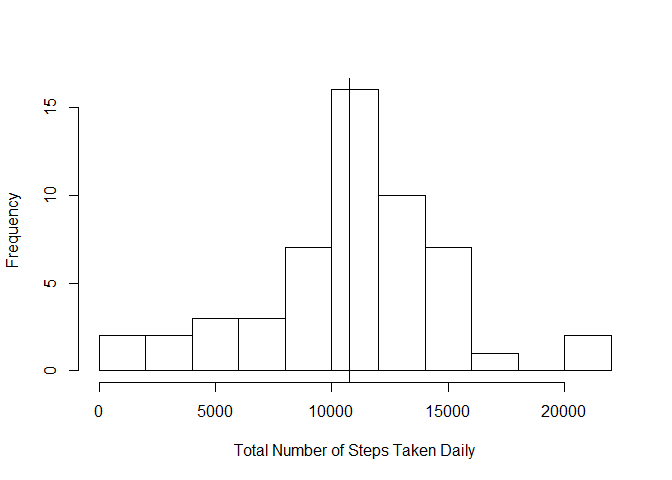
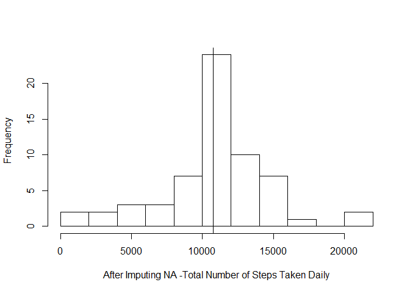
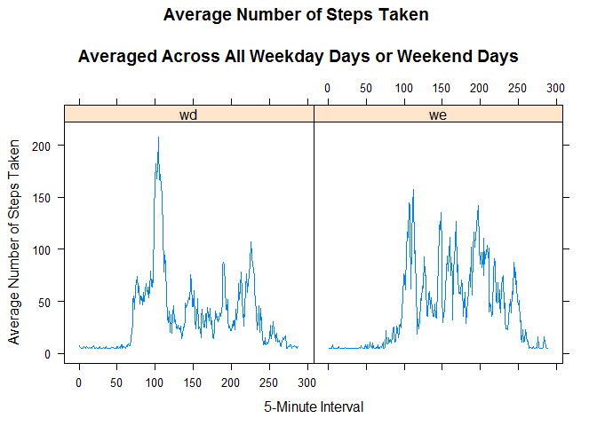

# Reproducible Research: Peer Assessment 1


## Loading and preprocessing the data
To load input data from a zip file from the current R working directory the following commands are used:


```r
setwd("D:/Falco/Data Science/repres/RepData_PeerAssessment1")
data <- read.csv(file="activity.csv")
# convert date to date data type
data$date <- as.Date(data$date) 
```


## What is mean total number of steps taken per day?

The steps to be performed in this task are:

- Create a new dataset ignoring missing data NA
- Plot a histogram of the total number of steps taken each day
- Report the mean and median total number of steps taken per day


```r
clean.data <- na.omit(data) 
# sum steps by date
daily.steps <- rowsum(clean.data$steps, format(clean.data$date, '%Y-%m-%d')) 
daily.steps <- data.frame(daily.steps) 
names(daily.steps) <- ("steps") 

hist(daily.steps$steps, 
     main=" ",
     breaks=10,
     xlab="Total Number of Steps Taken Daily")

mea<-mean(daily.steps$steps)
med<-median(daily.steps$steps)
abline(v=mea)
abline(v=med)
```

 

```r
mea
```

```
## [1] 10766.19
```

```r
med
```

```
## [1] 10765
```

## What is the average daily activity pattern?

The following steps are performed:

- Calculate average steps for each of 5-minute interval during a 24-hour period.
- Make a time series plot (i.e. type = "l") of the 5-minute interval (x-axis) and the average number of steps taken, averaged across all days (y-axis)
- Report which 5-minute interval, on average across all the days in the dataset, contains the maximum number of steps?
- Observe and comment the average daily activity pattern
- Plot time series of the 5-minute interval and the average number of steps taken, averaged across all days


```r
library(plyr)
# Calculate average steps for each of 5-minute interval during a 24-hour period
interval.mean.steps <- ddply(clean.data,~interval, summarise, mean=mean(steps))

library(ggplot2)
qplot(x=interval, y=mean, data = interval.mean.steps,  geom = "line",
      xlab="5-Minute Interval #",
      ylab="Number of Steps",
      main="Average Number of Steps Taken Averaged Across All Days"
      )
```

 

The interval with the maximum number of steps is calculated as follows:

```r
interval.mean.steps[which.max(interval.mean.steps$mean), ]
```

```
##     interval     mean
## 104      835 206.1698
```
The interval is apprimately that occurring at 8:35-8:40 a.m. .

## Imputing missing values
Note that there are a number of days/intervals where there are missing values (coded as NA). The presence of missing days may introduce bias into some calculations or summaries of the data. In this section the following steps are performed:

- Calculate and report the total number of missing values in the dataset (i.e. the total number of rows with NAs)
- Implement a strategy for filling in all of the missing values in the dataset. For this assignment the strategy is to use the mean for that 5-minute interval to replace missing valuse. 
- Create a new dataset that is equal to the original dataset but with the missing data filled in.
- Make a histogram of the total number of steps taken each day
- Calculate and report the mean and median total number of steps taken per day.
- Make following comments: Do these values differ from the estimates from the first part of the assignment? What is the impact of imputing missing data on the estimates of the total daily number of steps?


```r
nasnum <- sum(is.na(data$steps))
nasnum
```

```
## [1] 2304
```

```r
# Find the NA positions
na_pos <- which(is.na(data$steps))

# Create a vector of means
mean_vec <- rep(mean(data$steps, na.rm=TRUE), times=length(na_pos))

# Replace the NAs by the means
data[na_pos, "steps"] <- mean_vec

nasnum <- sum(is.na(data$steps))
nasnum
```

```
## [1] 0
```

```r
# sum steps by date
daily.steps <- rowsum(data$steps, format(data$date, '%Y-%m-%d')) 
daily.steps <- data.frame(daily.steps) 
names(daily.steps) <- ("steps") 

hist(daily.steps$steps, 
     main=" ",
     breaks=10,
     xlab="After Imputing NA -Total Number of Steps Taken Daily")

mea<-mean(daily.steps$steps)
med<-median(daily.steps$steps)
abline(v=mea)
abline(v=med)
```

 

```r
mea
```

```
## [1] 10766.19
```

```r
med
```

```
## [1] 10766.19
```

Q: Do these values (mean and median) differ from the estimates from the first part of the assignment? 
A: There is no difference.

Q: What is the impact of imputing missing data on the estimates of the total daily number of steps? 
A: The frequency of the bin where the mean is contained increased as expected, while the others remained the same. The qualitative shape of the histogram remains the same as the histogram from removed missing values. 


## Are there differences in activity patterns between weekdays and weekends?


```r
data$weektime <- as.factor(ifelse(weekdays(data$date) %in% 
                c("sabato","domenica"),"weekend", "weekday"))

mean.wd <- ddply(data[data$weektime=="weekday",],~interval, summarise, mean_on_weekdays=mean(steps))

mean.we <- ddply(data[data$weektime=="weekend",],~interval, summarise, mean_on_weekends=mean(steps))

mean.stp <- data.frame(interval=rep(1:288,2),mean_steps=c(mean.wd$mean_on_weekdays,mean.we$mean_on_weekends),type=c(rep("wd",288),rep("we",288)))

library(lattice)
xyplot(mean_steps ~ interval |factor(type), data = mean.stp, type = "l", main="Average Number of Steps Taken 
       \nAveraged Across All Weekday Days or Weekend Days",
       xlab="5-Minute Interval",
       ylab="Average Number of Steps Taken")
```

 

Activity during weekends is more evenly ditributed throughout the different day times.
